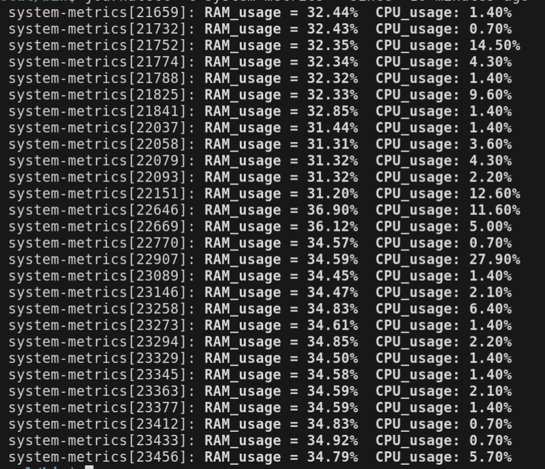

# System Metrics to Syslog Service

This project is designed to create a Systemd service that periodically collects and logs system metrics (RAM and CPU usage) to syslog. The service is composed of a Bash script, a Systemd service unit file, and a Systemd timer unit file.

## Project Structure

- **system-metrics-to-syslog.sh**: A Bash script that collects RAM and CPU usage metrics and logs them to syslog.
- **system-metrics.service**: A Systemd service unit file that defines the service to run the Bash script.
- **system-metrics.timer**: A Systemd timer unit file that schedules the service to run periodically.

## Requirements

- **Bash**: The script is written in Bash and should be compatible with most Unix-like systems.
- **Systemd**: The service and timer files are designed for systems using Systemd as their init system.
- **Syslog**: The script logs metrics to syslog, so a syslog daemon must be running on the system.

## Installation

1. **Clone the Repository**:
   ```bash
   git clone https://github.com/afleksik/System_metrics
   cd bash
   ```

2. **Make the Script Executable**:
   ```bash
   chmod +x system-metrics-to-syslog.sh
   ```

3. **Copy the Systemd Unit Files**:
   ```bash
   sudo cp system-metrics.service system-metrics.timer /etc/systemd/system/
   ```

4. **Reload Systemd**:
   ```bash
   sudo systemctl daemon-reload
   ```

5. **Enable and Start the Timer**:
   ```bash
   sudo systemctl enable system-metrics.timer
   sudo systemctl start system-metrics.timer
   ```

## Usage

- **Check the Status of the Service**:
  ```bash
  sudo systemctl status system-metrics.service
  ```

- **Check the Status of the Timer**:
  ```bash
  sudo systemctl status system-metrics.timer
  ```

- **View Logs in Syslog**:
  ```bash
  journalctl -t system-metrics
  ```
  If you want to filter logs you can use this commands:
  ```bash
  journalctl -t system-metrics --since "10 minutes ago"
  journalctl -t system-metrics --since "1 hour ago"
  journalctl -t system-metrics --since "2025-01-01 00:00:00" --until "2025-02-01 23:59:59"
  journalctl -t system-metrics --since today
  ```

## Script Details

### system-metrics-to-syslog.sh

This script collects the following metrics:
- **RAM Usage**: Percentage of used RAM.
- **CPU Usage**: Average CPU usage across all cores.

The metrics are logged to syslog with the tag `system-metrics` in the following format:
```
RAM Usage: ${ram_used}% CPU Usage: ${cpu_usage}%
```

### system-metrics.service

This service unit file defines the service to run the Bash script. It includes:
- **After=network.target**: Ensures the service starts after the network is up.
- **Restart=on-failure**: Automatically restarts the service if it fails.
- **ExecStart**: Specifies the path to the Bash script.

### system-metrics.timer

This timer unit file schedules the service to run every 10 seconds.

## Example Log Output




## Contributing

Contributions are welcome! Please open an issue or submit a pull request for any improvements or bug fixes.
